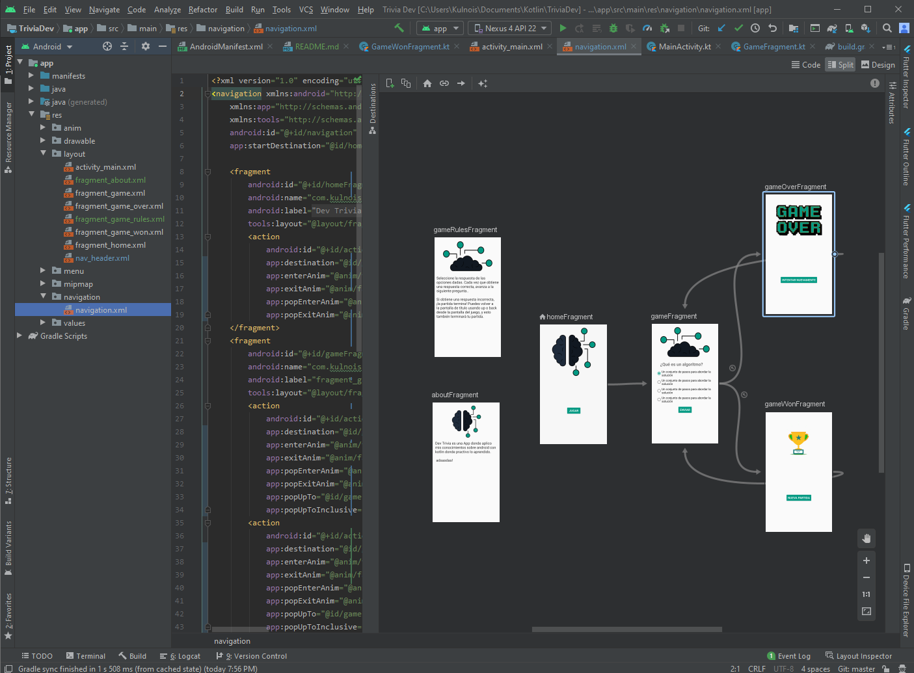

# [Dev Trivia]


Mi primer proyecto de Android con Kotlin donde implemento algunas librerías de  
como  y ; 
para la creación de una aplicación sencilla que hace preguntas sobre desarrollo de software en general.

## Como Implementar las librerías mencionadas de Android Jetpack

### Databinding

Para habilitar Databinding en su proyecto configura la opción de compilación `dataBinding` en `true` en el archivo `build.gradle` de tu modulo de la siguiente manera:
```gradle
android {
    ...
    buildFeatures {
        dataBinding true
    }
}
```
Ya con esto implementado modifique el archivo `activity_main.xml` y agregué la etiqueta `layout` de la siguiente manera:
```xml
<layout xmlns:android="http://schemas.android.com/apk/res/android"
        xmlns:app="http://schemas.android.com/apk/res-auto">
    <ConstraintLayout... /> <!-- UI layout's root element -->
</layout>
```
Ahora es su `MainActivity.kt` 
```kt
override fun onCreate(savedInstanceState: Bundle?) {
    super.onCreate(savedInstanceState)
    setContentView(R.layout.activity_main)
}
```
Modifique el método `onCreate` de la siguiente manera:
```kt
override fun onCreate(savedInstanceState: Bundle?) {
    super.onCreate(savedInstanceState)
    var binding: ActivityMainBinding = DataBindingUtil.setContentView(this, R.layout.activity_main)
}
```
Si a la hora de acceder a `ActivityMainBinding` no lo encuentra ir al Menú `Build` darle en `Clean Project` y despues en `Rebuild Project` del mismo Menú.
Ya con esos cambios podemos acceder a cualquier elemento de la vista desde la variable `binding` con el `id` del Elemento para eso agregamos un button a la vista:

```xml
<layout xmlns:tools="http://schemas.android.com/tools"
    xmlns:android="http://schemas.android.com/apk/res/android"
    xmlns:app="http://schemas.android.com/apk/res-auto">
    <androidx.constraintlayout.widget.ConstraintLayout
        android:layout_width="match_parent"
        android:layout_height="match_parent">

        <Button
            android:id="@+id/submitButton"
            android:layout_width="wrap_content"
            android:layout_height="wrap_content"
            android:text="Submit"
            app:layout_constraintBottom_toBottomOf="parent"
            app:layout_constraintEnd_toEndOf="parent"
            app:layout_constraintStart_toStartOf="parent"
            app:layout_constraintTop_toTopOf="parent" />
    </androidx.constraintlayout.widget.ConstraintLayout>
</layout>
```
Y lo llamamos desde la vista de la siguiente manera
```kt
override fun onCreate(savedInstanceState: Bundle?) {
    super.onCreate(savedInstanceState)
    var binding: ActivityMainBinding = DataBindingUtil.setContentView(this, R.layout.activity_main)

    binding.submitButton.setOnClickListener { view: View ->
        Toast.makeText(this, " event: Submit", Toast.LENGTH_LONG).show()
    }
}
```
Para mas información visitar la 

### Navigation

Para utilizar la librería en el proyecto tiene que agregar en el archivo `build.gradle` de nivel de proyectó la siguiente información:

En la parte superior del archivó junto a las otras `ext` variable agregar una variable para `navigationVersion`
```gradle
ext {
    ...
    nav_version = "2.3.0"
    ...
}
```
Y en el archivo `build.gradle` de tu modulo lo siguiente en `dependencies`:
```gradle
dependencies {
  ...
  implementation "androidx.navigation:navigation-fragment:$nav_version"
  implementation "androidx.navigation:navigation-ui-ktx:$nav_version"
  ...
}
```

Una vez agregado la librería crear un archivo en `res` de tipo `Navigation` en el cual se puede empezar a crear su gráfico de navegación para la Aplicación.


Para mas información visitar la 

[App Release Dev Trivia APK](release/app-dev-trivia.apk)

